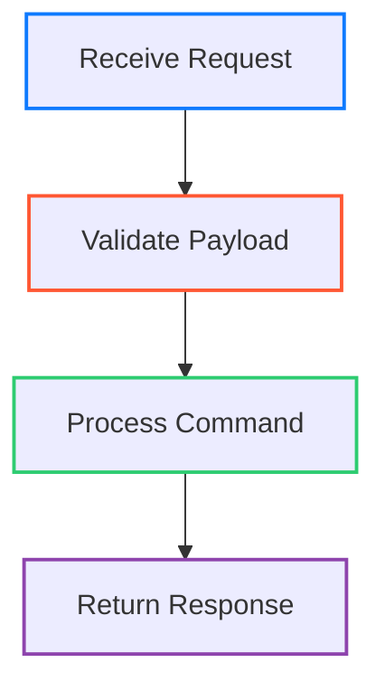

---
tags:
  - Documentation
  - Conventions
---

# Documentation Conventions

Use this guide whenever an LLM (or human contributor) creates or updates Markdown pages inside this repository. The goal is to keep every page consistent, link-safe, and ready for MkDocs.

---

## 1. Quick-Start Checklist
- Confirm the target directory and file name follow the naming rules.
- Add YAML front matter with `tags`; keep the primary title as the first H1 inside the file.
- Structure headings with numeric prefixes (e.g., `# 1. Topic`, `## 1.1. Detail`).
- Prefer concise explanations backed by runnable code or concrete examples.
- Append a `# **References:**` section when external sources are cited.

If any item is unclear, ask for clarification before generating output.

---

## 2. Repository Layout & Naming Rules

### 2.1. Directory Naming
- Always use lowercase kebab-case; keep names stable once published (e.g., `interview-questions`, `java-se-17-lts`).
- Place new pages beside related content. For example, Java 8 tips belong in `docs/jvm-languages/java/...`.

### 2.2. File Naming
- Regular content: three-digit prefix + lowercase kebab-case (e.g., `001_lambda-expressions.md`).
- Reserve prefixes so new pages can slot in later (`001`, `005`, `010`).
- Use `index.md` to represent directory landing pages (no numeric prefix).
- Do not rename existing files without explicit instructions (links in the published site may break).

### 2.3. Ancillary Files
- `.pages` files define local navigation; use short, meaningful labels there (e.g., `Lambda`, `Streams`).
- Do not modify `mkdocs.yml` navigation—the site relies on `mkdocs-awesome-pages-plugin`.
- Assets (images, diagrams) reside under `docs/assets/` or the nearest `images/` folder within the topic tree.

---

## 3. Front Matter

Every new document must begin with YAML front matter. Existing documents without front matter should be upgraded when touched.

```yaml
---
tags:
  - PrimaryTopic
  - SecondaryTopic
  - OptionalFramework
---
```

### 3.1. Guidelines
- Maintain at least one tag; reuse existing tags whenever possible.
- Keep tag names Title Case or readable lowercase words (no camelCase).
- Always provide the main title as the first H1 inside the Markdown file; avoid relying on front matter or navigation metadata for the page heading.
- Only add a `title` field when a custom nav label is unavoidable, and keep it in sync with the H1.
- When diagrams can clarify control flow or architecture, prefer Mermaid to ASCII art.

---

## 4. Mermaid Diagrams

- Use Mermaid for flows, relationships, or timelines that benefit from visual explanations.
- Keep diagrams concise; label nodes clearly and provide supporting text around the diagram.
- Apply colors via `stroke` attributes only (`stroke:#2E86DE,stroke-width:2px`); never use `fill`.
- Ensure stroke width is at least `2px` so colors remain legible in light and dark themes.
- Validate diagrams with the MkDocs preview to catch syntax or styling issues early.
- Style shapes via `classDef`/`class` declarations; avoid inline `style` statements so formatting remains reusable.
- The `mermaid2` plugin renders diagrams server-side—keep diagrams lightweight and compatible with current Mermaid syntax.

### 4.1. Sample Diagram
* **Example:**

Accompany each diagram with supporting text that explains what the colored nodes represent and why the flow matters.

---

## 5. Document Skeleton

Start from this template and adapt section titles as needed. A reusable starter file is available at [docs/templates/page-template.md](../docs/templates/page-template.md).

````markdown
---
tags:
  - ExampleTag
---

# 1. Topic Name

Brief opening paragraph describing scope and prerequisites. Mention versions or platforms when relevant.

## 1.1. Key Concept

Explain the idea plainly. Add bullet lists for feature breakdowns and use blockquotes for notes or warnings.

* **Example:**
```language
# Minimal, runnable example
```

## 1.2. Deep Dive

Cover edge cases, gotchas, or alternative approaches. Reference related docs via relative links.

## Related topics
1. [Related Topic](../path/to/001_related-topic.md)
2. [Another Page](../path/to/002_another-page.md)

# **References:**
1. [Authoritative Source](https://example.com){ target="_blank" rel="noopener noreferrer" }
````

### 5.1. Heading Rules
- Prefix main sections with `# 1.`, `# 2.`; sub-sections use `## 1.1.` format. Skip numbering only inside callout titles or checklists.
- Never jump levels (do not go from H1 to H3 without an H2).
- Keep H1 unique per page.
- Limit the heading hierarchy to H3; MkDocs only adds levels up to H3 to the generated table of contents.

---

## 6. Writing Style

- Present tense, active voice, and reader-focused guidance (“You can configure…”, “Use this pattern when…”).
- Define acronyms on first mention; cite language or framework versions when differences matter.
- Prefer short paragraphs (2–4 sentences). Use tables or bullet lists for comparative information.
- Highlight crucial insights with bold text or callouts; avoid decorative emphasis.
- When summarizing release notes or feature sets, state the context (e.g., “Introduced in Java 17”).

---

## 7. Markdown Standards

### 7.1. Lists
- Use `-` for unordered lists and maintain sentence casing.
- When a bullet introduces a code sample, keep the explanation short (usually ending with a colon) and indent the fenced code block under that bullet so the narrative and snippet stay grouped together.
- Indent nested list items by two spaces.

### 7.2. Code Formatting
- Wrap inline code with backticks (e.g., ``Optional<String>``).
- Use fenced code blocks with a language hint. Supported hints include `bash`, `json`, `java`, `javascript`, `kotlin`, `python`, `xml`, `yaml`.
  - Inside list items, indent fenced code blocks by four spaces so they remain children of the descriptive bullet (mirroring the style in `001_date-and-time-api.md`).
- Keep code samples executable or at least syntactically valid; annotate complex sections with short comments explaining intent.
- Precede non-trivial snippets with a short sentence or bullet describing the scenario.
- For multi-part demos, label them clearly (e.g., “**Example 1:** Basic usage”).
- For complex flows, pair code samples with a Mermaid diagram when it clarifies the interaction.

### 7.3. Blockquotes & Callouts
- `> **NOTE:**` for useful context; `> **WARNING:**` for risk/anti-pattern; `> **TIP:**` for shortcuts or recommended practices.
- Keep callouts under five lines when possible.

### 7.4. Tables
- Align with pipes and dashes; ensure header rows exist. Prefer tables only when they add clarity over bullet lists.

### 7.5. Horizontal Rules
- Use `---` to separate major sections sparingly.

### 7.6. Admonitions
- Prefer MkDocs admonition syntax over plain blockquotes when highlighting guidance or warnings.
- Supported types include `note`, `tip`, `warning`, `important`, and more from Material icons.
  ```markdown
  !!! tip "Prefer Streams"
      Refactor loops into the Stream API when you need declarative data processing.
  ```
- Keep titles short and sentence case; content inside admonitions should follow normal paragraph styling.

### 7.7. Footnotes & Definition Lists
- Use standard Markdown footnote syntax when citing additional details without interrupting flow.
  ```markdown
  Streams are lazily evaluated[^lazy].

  [^lazy]: Operations only run when a terminal method executes.
  ```
- For glossaries or term explanations, use definition lists:
  ```markdown
  Functional Interface
  :  Single abstract method type used in lambda expressions.
  ```

### 7.8. Task Lists
- When tracking follow-up items, use GitHub-style checkboxes (extension renders custom boxes).
  ```markdown
  - [ ] Review performance benchmarks
  - [x] Update code sample to Java 21 syntax
  ```
- Reserve task lists for TODO-style sections or checklists (e.g., the pre-submission review).

### 7.9. Emojis & Icons
- Material’s emoji extension translates aliases like `:sparkles:` into SVG icons; use them sparingly and only when they aid scannability.
- Avoid decorative emoji in technical explanations or headings.

---

## 8. Links & Cross-References

### 8.1. Internal Links
- Always use relative paths including the `.md` extension (e.g., `[Stream API](../005_stream-api.md)`).
- Never attach attributes to internal links.
- Link to `index.md` for directory landing pages (e.g., `[Best Practices](best-practices/index.md)`).

### 8.2. External Links
- Append `{ target="_blank" rel="noopener noreferrer" }`.
- Choose descriptive link text that states the destination (e.g., `[Oracle - Records Overview]`).
- Verify URLs respond with the expected content; avoid shortened links.

### 8.3. References Section
- Title the section `# **References:**` exactly.
- Use ordered lists. Include security attributes on each external reference.
- If no external sources were used, omit the section rather than listing placeholders.

### 8.4. Example Links
```markdown
- Internal: [Functional Interfaces](../best-practices/001_functional-interfaces-tips-and-best-practices.md)
- External: [Oracle - Records Overview](https://docs.oracle.com/en/java/javase/17/language/records.html){ target="_blank" rel="noopener noreferrer" }

# **References:**
1. [Oracle - Records Overview](https://docs.oracle.com/en/java/javase/17/language/records.html){ target="_blank" rel="noopener noreferrer" }
```
When adding examples, keep link text descriptive and verify the relative path resolves correctly in the built site.

---

## 9. Images & Assets

- Store shared assets under `docs/assets/` and topic-specific assets in a local `images/` folder near the Markdown file.
- File names follow the same numeric prefix + kebab-case rule (`001_dependency-graph.png`).
- Reference images with relative paths and meaningful alt text:
  ```markdown
  
  ```
- Optimize images before adding them; avoid embedding SVGs that rely on external fonts.
- Thanks to the `panzoom` plugin, readers can zoom diagrams—provide assets at sufficient resolution without exceeding reasonable file sizes.

---

## 10. Code Samples

- Include language identifiers (` ```java `, ` ```kotlin `, etc.) to enable syntax highlighting.
- Keep samples self-contained and minimal while demonstrating the concept.
- Prefer four-space indentation. Avoid tabs.
- Precede non-trivial snippets with a short sentence or bullet describing the scenario.
- For multi-part demos, label them clearly (e.g., “**Example 1:** Basic usage”).
- For complex flows, pair code samples with a Mermaid diagram when it clarifies the interaction.

### 10.1. Example Snippet
* **Example:** Showcasing a simple Spring component with dependency injection.
```java
package com.example.todo;

import org.springframework.stereotype.Service;

@Service
public class TaskNotifier {

    private final EmailClient emailClient;

    public TaskNotifier(EmailClient emailClient) {
        this.emailClient = emailClient;
    }

    public void notifyAssignee(Task task) {
        if (task.isCompleted()) {
            return; // nothing to notify
        }
        emailClient.send(task.assigneeEmail(), "Task reminder", task.summary());
    }
}
```
Call out any assumptions (e.g., supporting classes) and keep comments focused on intent rather than paraphrasing the code.

---

## 11. Updating Existing Pages

- Preserve established section numbering unless there’s a structural change; renumber only when a new flow is required.
- Review nearby links and anchors when moving or renaming headings.
- Modernize legacy formatting (missing front matter, absent link attributes) when touching a file, even if outside the immediate change.
- Flag any contradictions you notice between documents; suggest follow-up tasks if resolution is unclear.

---

## 12. Pre-Submission Review

Run through this list before finalizing output:
- [ ] File name and location comply with naming conventions.
- [ ] Front matter exists with accurate `tags` (and `title`, if needed).
- [ ] Headings follow numeric hierarchy and match the narrative flow.
- [ ] All internal links are relative and valid; all external links include security attributes.
- [ ] Code samples compile or express the concept without syntax errors.
- [ ] References section is present when external sources informed the content.
- [ ] Spelling, grammar, and formatting align with the site’s tone.
- [ ] Markdown preview (MkDocs or editor preview) renders as expected.

Following these conventions keeps the Programming-Note knowledge base consistent, readable, and ready for automation.

---

## 13. Metadata Examples

### 13.1. Tags Example
```yaml
---
tags:
  - Java
  - Programming
  - JDK
---
```

### 13.2. Metadata Front Matter
```yaml
---
title: Custom Page Title
description: Page description for SEO
---
```

### 13.3. Combined Example
```yaml
---
title: Dependency Injection Patterns
description: Key Spring Boot DI patterns with practical examples
tags:
  - Spring Boot
  - Dependency Injection
  - Best Practices
---
```
Keep descriptions short (under 150 characters) so they render well in search listings.
