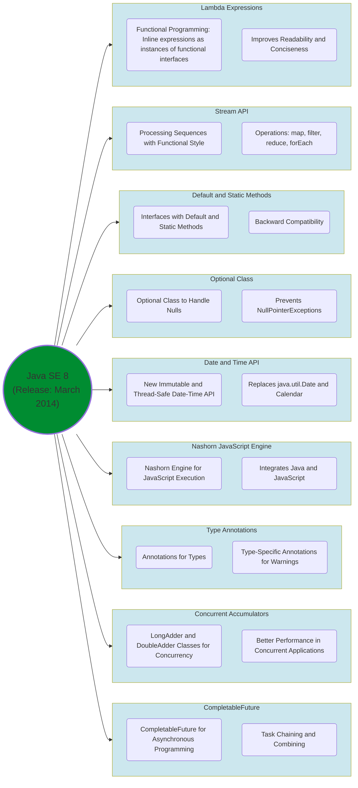
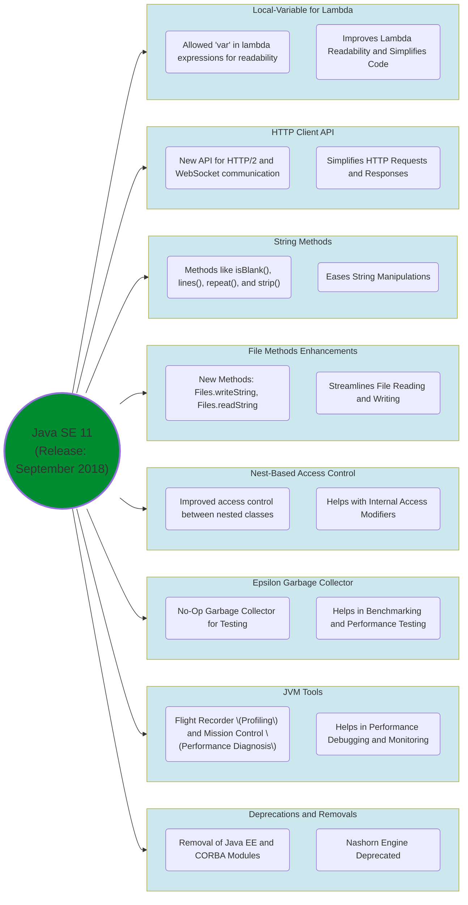
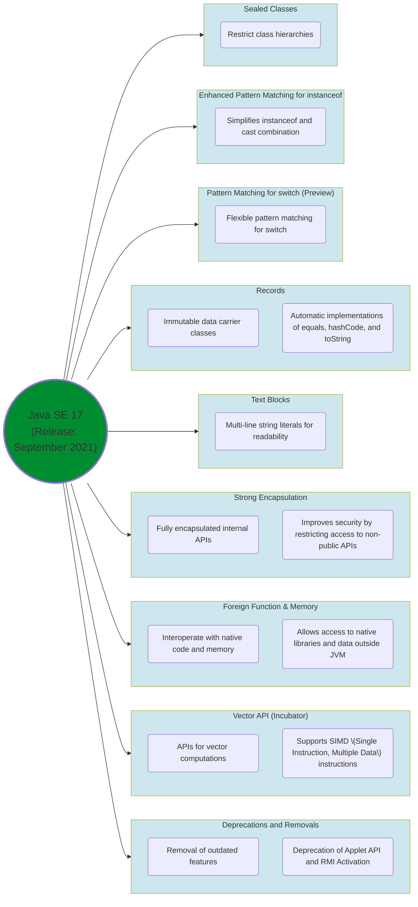
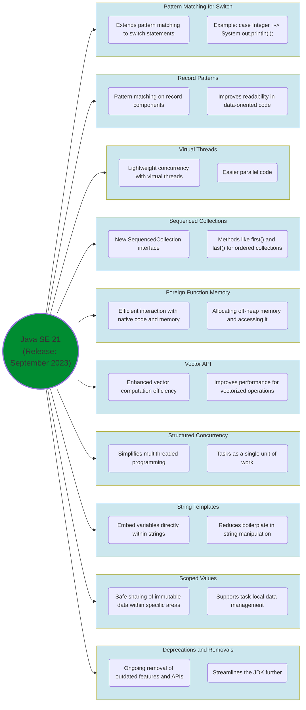

---
tags:
  - Java
  - JDK
  - Comparison
---

# Java JDK Comparison Summary

## Table of Contents

- [1. **Java SE 8 | Release Date:** March 2014]
- [2. **Java SE 11 | Release Date:** September 2018]
- [3. **Java SE 17 | Release Date:** September 2021]
- [4. **Java SE 21 | Release Date:** September 2023]
- [**Comparison**]
- [**Summary**]
  - [1. **Language Features**]
  - [2. **APIs**]
  - [3. **Performance**]
  - [4. **Deprecations and Removals**]

# 1. **Java SE 8 | Release Date:** March 2014

<details>
  <summary>Mind Map</summary>
  </br>



</details>

<details>
  <summary>Main Features</summary>
  </br>
  
1. **Lambda Expressions**

    - Enabled functional programming by allowing inline expressions to be treated as instances of functional interfaces, improving readability and conciseness.
    - **Example:**
    ```java
    import java.util.Arrays;
    import java.util.List;
      
    public class LambdaExample {
        public static void main(String[] args) {
            List<String> names = Arrays.asList("Alice", "Bob", "Charlie", "David");
      
            // Using lambda expression to print each name
            names.forEach(name -> System.out.println(name));
        }
    }
    ```

2. **Stream API**

    - Introduced a new API for processing sequences of elements (e.g., collections) in a functional style with operations like `map`, `filter`, `reduce`, and `forEach`.
    - **Example:**
    ```java
    import java.util.Arrays;
    import java.util.List;
    import java.util.stream.Collectors;
    
    public class StreamExample {
        public static void main(String[] args) {
            List<Integer> numbers = Arrays.asList(1, 2, 3, 4, 5);
    
            // Filtering even numbers and multiplying by 2 using map and filter
            List<Integer> result = numbers.stream()
                                          .filter(n -> n % 2 == 0)
                                          .map(n -> n * 2)
                                          .collect(Collectors.toList());
    
            System.out.println(result); // Output: [4, 8]
        }
    }
    ```

3. **Default and Static Methods in Interfaces**

    - Allowed interfaces to have default and static methods, enabling backward-compatible evolution of interfaces.
    - **Example:**
    ```java
    interface MyInterface {
        // Default method with implementation
        default void printMessage() {
            System.out.println("Default message from interface");
        }
    
        // Static method with implementation
        static void staticMessage() {
            System.out.println("Static message from interface");
        }
    }
    
    public class DefaultStaticMethodExample implements MyInterface {
        public static void main(String[] args) {
            MyInterface myInterface = new DefaultStaticMethodExample();
            myInterface.printMessage(); // Default method
    
            MyInterface.staticMessage(); // Static method
        }
    }
    ```

4. **Optional Class**

    - Introduced the `Optional` class to handle potentially absent (null) values safely, reducing `NullPointerException` occurrences.
    - **Example:**
    ```java
    import java.util.Optional;

    public class OptionalExample {
        public static void main(String[] args) {
            Optional<String> name = Optional.of("John");
            name.ifPresent(System.out::println); // Output: John
    
            Optional<String> emptyName = Optional.empty();
            System.out.println(emptyName.orElse("No name")); // Output: No name
        }
    }
    ```

5. **Date and Time API (`java.time`)**

    - Replaced `java.util.Date` and `Calendar` with a new Date and Time API, offering immutable and thread-safe date-time representations.
    - **Example:**
    ```java
    import java.time.LocalDate;
    import java.time.LocalDateTime;
    import java.time.Month;
    import java.time.format.DateTimeFormatter;
    
    public class DateTimeExample {
        public static void main(String[] args) {
            LocalDate date = LocalDate.now();
            System.out.println(date); // Current date, e.g., 2024-11-14
    
            LocalDateTime dateTime = LocalDateTime.of(2024, Month.NOVEMBER, 14, 15, 30);
            System.out.println(dateTime); // 2024-11-14T15:30
    
            // Format a date
            DateTimeFormatter formatter = DateTimeFormatter.ofPattern("dd-MM-yyyy");
            System.out.println(date.format(formatter)); // 14-11-2024
        }
    }
    ```

6. **Nashorn JavaScript Engine**

    - Included the Nashorn engine, enabling Java to directly execute JavaScript code and integrate Java and JavaScript more easily.
    - **Example:**
    ```java
    import javax.script.ScriptEngine;
    import javax.script.ScriptEngineManager;
    import javax.script.ScriptException;
    
    public class NashornExample {
        public static void main(String[] args) throws ScriptException {
            ScriptEngine engine = new ScriptEngineManager().getEngineByName("nashorn");
    
            // Execute JavaScript code within Java
            engine.eval("print('Hello from JavaScript!');");
        }
    }
    ```

7. **Type Annotations**

    - Annotations can be applied to any use of a type.
    - **Example:**
    ```java
    import java.util.List;

    public class TypeAnnotationExample {
        public static void main(String[] args) {
            @SuppressWarnings("unchecked")
            List<String> names = (List<String>) new Object(); // Type annotation for unchecked warning
        }
    }
    ```

8. **Concurrent Accumulators**

    - New classes like LongAdder and DoubleAdder for better performance in concurrent applications.
    - **Example:**
    ```java
    import java.util.concurrent.atomic.LongAdder;

    public class ConcurrentAccumulatorExample {
        public static void main(String[] args) {
            LongAdder adder = new LongAdder();
    
            // Incrementing the accumulator
            adder.increment();
            adder.increment();
    
            // Getting the value
            System.out.println(adder.sum()); // Output: 2
        }
    }
    ```
  
9. **CompletableFuture and Concurrency Enhancements**

    - Added `CompletableFuture` for asynchronous programming, allowing chaining and combining of tasks.
    - **Example:**
    ```java
    import java.util.concurrent.CompletableFuture;
    import java.util.concurrent.ExecutionException;
    
    public class CompletableFutureExample {
        public static void main(String[] args) throws ExecutionException, InterruptedException {
            CompletableFuture<Integer> future = CompletableFuture.supplyAsync(() -> {
                // Simulate a task
                return 5;
            }).thenApplyAsync(result -> result * 2); // Chaining
    
            System.out.println(future.get()); // Output: 10
        }
    }
    ```
</details>

---

# 2. **Java SE 11 | Release Date:** September 2018

<details>
  <summary>Mind Map</summary>
  </br>



</details>

<details>
  <summary>Main Features</summary>
  </br>

1. **Local-Variable Syntax for Lambda Parameters**

    - Allowed the `var` keyword in lambda expressions, improving readability.
    - **Example:**
    ```java
    // 1. Local-Variable Syntax for Lambda Parameters
    // Using 'var' in lambda expressions for improved readability
    import java.util.List;
    import java.util.function.Consumer;
    
    public class LambdaVarExample {
        public static void main(String[] args) {
            List<String> names = List.of("Alice", "Bob", "Charlie");
    
            // Using 'var' to declare lambda parameter type
            Consumer<var> printName = name -> System.out.println(name);
            names.forEach(printName);
        }
    }
    ```
        
2. **HTTP Client API**

    - Introduced a new `java.net.http` API for HTTP/2 and WebSocket communication, simplifying HTTP requests.
    - **Example:**
    ```java
    // 2. HTTP Client API
    // New HTTP Client for HTTP/2 and WebSocket communication
    import java.net.URI;
    import java.net.http.HttpClient;
    import java.net.http.HttpRequest;
    import java.net.http.HttpResponse;
    
    public class HttpClientExample {
        public static void main(String[] args) throws Exception {
            HttpClient client = HttpClient.newHttpClient();
            HttpRequest request = HttpRequest.newBuilder()
                                             .uri(new URI("https://api.github.com"))
                                             .build();
    
            HttpResponse<String> response = client.send(request, HttpResponse.BodyHandlers.ofString());
            System.out.println(response.body());
        }
    }
    ```
       
3. **New String Methods**

    - Added methods like `isBlank()`, `lines()`, `repeat(int)`, and `strip()` for common string manipulations.
    - **Example:**
    ```java
    // 3. New String Methods
    // Using new string methods like isBlank(), lines(), repeat(), and strip()
    public class StringMethodsExample {
        public static void main(String[] args) {
            String text = "   Hello, Java SE 11!   ";
    
            // isBlank()
            System.out.println("Is text blank? " + text.isBlank());
    
            // strip()
            System.out.println("Stripped text: '" + text.strip() + "'");
    
            // repeat()
            System.out.println("Repeated text: " + "Java ".repeat(3));
    
            // lines()
            text.lines().forEach(System.out::println);
        }
    }
    ```
       
4. **New File Methods Enhancements**

    - New file I/O methods such as `Files.writeString` and `Files.readString`, streamlining file reading and writing.
    - **Example:**
    ```java
    // 4. New File Methods Enhancements
    // Using new methods for easier file reading and writing
    import java.io.IOException;
    import java.nio.file.Files;
    import java.nio.file.Path;
    
    public class FileMethodsExample {
        public static void main(String[] args) throws IOException {
            Path filePath = Path.of("example.txt");
    
            // writeString()
            Files.writeString(filePath, "Hello, Java SE 11!\nWelcome to new file methods.");
    
            // readString()
            String content = Files.readString(filePath);
            System.out.println("File Content: \n" + content);
        }
    }
    ```
       
5. **Nest-Based Access Control**

    - Improves access control between nested classes.
    - **Example:**
    ```java
    // 5. Nest-Based Access Control
    // Improved access control between nested classes
    public class OuterClass {
        private String outerField = "Outer Field";
    
        public class NestedClass {
            public void displayOuter() {
                // Accessing outer class's private field
                System.out.println(outerField);
            }
        }
    
        public static void main(String[] args) {
            OuterClass outer = new OuterClass();
            NestedClass nested = outer.new NestedClass();
            nested.displayOuter();
        }
    }
    ```
       
6. **Epsilon Garbage Collector (GC)**

    - Introduced a no-op garbage collector ("Epsilon") for testing and benchmarking.
    - **Example:**
    ```java
    // 6. Epsilon Garbage Collector (GC)
    // No-op garbage collector (Epsilon) for testing purposes
    public class EpsilonGCExample {
        public static void main(String[] args) {
            // Epsilon GC is enabled with the following JVM option:
            // -XX:+UseEpsilonGC
            System.out.println("Epsilon GC is in use, no actual garbage collection happens.");
        }
    }
    ```
       
7. **Flight Recorder and Mission Control**

    - Added tools for profiling and diagnosing JVM issues, helpful in performance debugging.
    - **Example:**
    ```java
    // Use JDK tools or mission control to record and analyze performance in your JVM applications
    // Example command to start recording:
    java -XX:StartFlightRecording=filename=recording.jfr -jar MyApp.jar
    ```
       
8. **Deprecations and Removals**

    - Removed older, less commonly used modules like Java EE and CORBA for a leaner JDK.
    - Marked the Nashorn JavaScript engine as deprecated, signaling its future removal.
</details>

---

# 3. **Java SE 17 | Release Date:** September 2021

<details>
  <summary>Mind Map</summary>
  </br>



</details>

<details>
  <summary>Main Features</summary>
  </br>

1. **Sealed Classes**
  
    - Enabled developers to restrict which classes can extend or implement a superclass/interface, improving control over class hierarchies.
    - **Example:**
    ```java
    public sealed class Vehicle permits Car, Truck { }
    public final class Car extends Vehicle { }
    public final class Truck extends Vehicle { }
    ```

2. **Enhanced Pattern Matching for `instanceof`**  

    - Simplifies the common pattern of using `instanceof` followed by a cast by allowing the cast to be done in one step.
    - **Example:**
    ```java
    if (obj instanceof String s) {
        System.out.println(s.toUpperCase());  // s is already cast to String
    }
    ```
3. **Pattern Matching for `switch` (Preview)**

    - Enhanced the `switch` statement to allow more flexible pattern matching.
    - **Example:**
    ```java
    public class SwitchPatternExample {
        public static void main(String[] args) {
            Object obj = "Hello, Pattern Matching!"; // This could be any object
    
            // Switch with pattern matching
            String result = switch (obj) {
                case Integer i -> "It's an Integer: " + i; // Matches if obj is Integer
                case String s -> "It's a String: " + s; // Matches if obj is String
                case null -> "It's null"; // Matches if obj is null
                default -> "Unknown type"; // Default case
            };
    
            System.out.println(result);
        }
    }
    ```

4. **Records**

    - A new way to declare data carrier classes that are immutable and provide automatic implementations of methods like `equals`, `hashCode`, and `toString`.
    - **Example:**
    ```java
    public record Person(String name, int age) { }
    Person person = new Person("Alice", 30);
    ```

5. **Text Blocks**

    - Multi-line string literals for easier readability and handling of complex strings.
    - **Example:**
    ```java
    String json = """
        {
            "name": "Alice",
            "age": 30
        }
        """;
    ```
6. **Strong Encapsulation for JDK Internals**

    - In Java 17, **strong encapsulation for JDK internals** refers to the practice of restricting access to internal APIs within the JDK. This change is part of a broader effort by the Java platform to improve security, maintainability, and modularity by preventing unintended or unsupported access to internal implementation details.

	* Key Aspects:

	1. **What Are JDK Internals?**
    
	    - These are classes and APIs within the JDK that were not intended for public use. Examples include `sun.misc.Unsafe` and other `sun.*` packages.
	    - These APIs were often used by frameworks, libraries, or applications to access low-level functionality but were undocumented and subject to change without notice.
	    
	2. **Strong Encapsulation Explained:**
    
	    - With **Jigsaw** (introduced in Java 9), the module system was introduced, which encapsulates internal APIs within modules.
	    - In earlier Java versions (e.g., Java 9–16), internal APIs could be accessed by using command-line options like `--add-exports` or `--add-opens` to bypass the encapsulation.
	    - In Java 17, encapsulation has been made **stronger** by requiring explicit flags for reflective access, and some internal APIs are no longer accessible at all, even with these flags.
	    
	3. **Why Strong Encapsulation?**
    
	    - **Security:** Prevent misuse of internal classes that could lead to vulnerabilities.
	    - **Stability:** Internal APIs are not guaranteed to be stable across Java versions, so relying on them creates brittle applications.
	    - **Maintainability:** The JDK can evolve more freely without needing to support undocumented or deprecated APIs.
	    
	4. **Implications:**
	    - Applications or libraries relying on internal APIs may fail unless updated.
	    - Developers need to replace the use of internal APIs with standard, supported alternatives provided by the JDK.
	    - Some APIs have been moved to public modules. For example, `java.util.logging` and similar packages are publicly accessible via standard modules.
	    
	5. **Bypassing Strong Encapsulation:**
	    - If absolutely necessary, you can still use command-line flags like:        
	        `java --add-opens java.base/sun.misc=ALL-UNNAMED -jar your-app.jar`
	        
	    - However, this is discouraged, as future versions of Java may further restrict such workarounds.
	    
	1. **Alternatives to JDK Internals:**
	    - Many internal APIs now have public equivalents. For instance:
	        - Instead of `sun.misc.Unsafe`, consider using `VarHandle` or other `java.util.concurrent` utilities.
	        - For reflection, use the `java.lang.reflect` package.
	    - Always prefer official APIs over internal ones to ensure compatibility.

	**Summary:**
	
	The strong encapsulation of JDK internals in Java 17 is part of the ongoing effort to solidify the modular architecture introduced in Java 9, making the platform more secure and maintainable while encouraging developers to adopt supported, stable APIs.

7. **Foreign Function & Memory API (Incubator)**

    - Allows Java programs to interoperate with code and data outside of the JVM, including native libraries.

8. **Vector API (Incubator)**

    - Provides APIs for vector computations, allowing Java to take advantage of SIMD (Single Instruction, Multiple Data) instructions.

9. **Deprecations and Removals**

    - Removed outdated features, including the Applet API and RMI Activation.

</details>

---

# 4. **Java SE 21 | Release Date:** September 2023

<details>
  <summary>Mind Map</summary>
  </br>



</details>

<details>
  <summary>Main Features</summary>
  </br>

1. **Pattern Matching for Switch**

    - Extends pattern matching to `switch` statements and expressions, enabling more expressive and flexible patterns.
    - **Example:**
    ```java
    switch (obj) {
        case Integer i -> System.out.println("Integer: " + i);
        case String s -> System.out.println("String: " + s);
        default -> System.out.println("Unknown");
    }
    ```

2. **Record Patterns**

    - Enhanced destructuring by allowing pattern matching on record components, improving readability in data-oriented code.
    - **Example:**
    ```java
    record Point(int x, int y) { }

    public class RecordPatternExample {
        public static void main(String[] args) {
            Point p = new Point(1, 2);
            if (p instanceof Point(int x, int y)) {
                System.out.println("x: " + x + ", y: " + y);
            }
        }
    }
    ```

3. **Virtual Threads**

    - Introduced lightweight concurrency with virtual threads, making it easier to write scalable, parallel code.
    - **Example:**
    ```java
    var thread = Thread.startVirtualThread(() -> {
        System.out.println("Virtual Thread running!");
    });
    thread.join();
    ```

4. **Sequenced Collections**

    - Introduced the `SequencedCollection` interface with methods like `first()` and `last()` for ordered collections.
    - **Examples:**
    ```java
    import java.util.List;
    import java.util.ArrayList;
    import java.util.SequencedCollection;
    
    public class SequencedCollectionExample {
        public static void main(String[] args) {
            // Create a simple list that implements SequencedCollection
            List<String> fruits = new ArrayList<>();
            fruits.add("Apple");
            fruits.add("Banana");
            fruits.add("Cherry");
            
            // Access the first and last elements using the new methods
            String firstFruit = fruits.stream().findFirst().orElse("No first element");
            String lastFruit = fruits.stream().skip(fruits.size() - 1).findFirst().orElse("No last element");
    
            System.out.println("First fruit: " + firstFruit);
            System.out.println("Last fruit: " + lastFruit);
        }
    }
    ```

5. **Foreign Function & Memory API**

    - Enhanced for better performance and usability, allowing more efficient interaction with native code and memory.
    - **Example:**
    ```java
    import jdk.incubator.foreign.*;
    import java.lang.foreign.*;
    
    public class ForeignMemoryExample {
        public static void main(String[] args) {
            // Get the MemorySegment allocator (off-heap memory)
            try (var arena = Arena.openConfined()) {
                // Allocate a MemorySegment of 10 integers (40 bytes)
                MemorySegment segment = arena.allocate(MemoryLayout.ofSequence(10, ValueLayout.JAVA_INT));
                
                // Write data into the allocated memory
                for (int i = 0; i < 10; i++) {
                    segment.set(ValueLayout.JAVA_INT, i * 4, i * 10); // Setting integer values
                }
    
                // Read data from the allocated memory
                System.out.println("Memory segment contents:");
                for (int i = 0; i < 10; i++) {
                    int value = segment.get(ValueLayout.JAVA_INT, i * 4);
                    System.out.println("Value at index " + i + ": " + value);
                }
            }
        }
    }
    ```

6. **Vector API**

    - Further enhancements for vector computations, improving the efficiency of vectorized operations.
    - **Example:**
    ```java
    import jdk.incubator.vector.*;
    
    public class VectorAPIExample {
        public static void main(String[] args) {
            // Create vectors for two arrays of integers
            int[] arr1 = {1, 2, 3, 4, 5, 6, 7, 8};
            int[] arr2 = {8, 7, 6, 5, 4, 3, 2, 1};
            int[] result = new int[8];
            
            // Load data into vectors
            var v1 = IntVector.fromArray(VectorSpecies.SPECIES_256, arr1, 0);
            var v2 = IntVector.fromArray(VectorSpecies.SPECIES_256, arr2, 0);
            
            // Perform element-wise addition of vectors
            var sum = v1.add(v2);
            
            // Store the result back into the result array
            sum.intoArray(result, 0);
            
            // Output the result
            System.out.println("Result of vector addition:");
            for (int value : result) {
                System.out.print(value + " "); // Result: 9 9 9 9 9 9 9 9 
            }
        }
    }
    ```

7. **Structured Concurrency (Preview)**

    - Simplifies multithreaded programming by treating multiple tasks running in different threads as a single unit of work, reducing boilerplate code.
    - **Example:**
    ```java
    try (var scope = new StructuredTaskScope.ShutdownOnFailure()) {
        var task1 = scope.fork(() -> task1());
        var task2 = scope.fork(() -> task2());
        scope.join();  // Waits for all tasks to complete
    }
    ```

8. **String Templates (Preview)**

    - Allowed variable embedding directly within strings, reducing boilerplate in string manipulations.
  
9. **Scoped Values (Preview)**

    - Enabled safe sharing of immutable data within specific code areas, supporting task-local data management.

10. **Deprecations and Removals**

    - Continued removal of outdated features and APIs, streamlining the JDK further.

</details>

---

# **Comparison**

| Feature                       | Java 8                      | Java 11                     | Java 17                     | Java 21                       |
|-------------------------------|-----------------------------|-----------------------------|-----------------------------|-------------------------------|
| **Lambda Expressions**        | ✅                          | ✅                          | ✅                          | ✅                            |
| **Streams API**               | ✅                          | ✅                          | ✅                          | ✅                            |
| **Optional Class**            | ✅                          | ✅                          | ✅                          | ✅                            |
| **New Date and Time API**     | ✅                          | ✅                          | ✅                          | ✅                            |
| **HTTP Client API**           | 🚫                          | ✅                          | ✅                          | ✅                            |
| **Pattern Matching**          | 🚫                          | 🚫                          | `instanceof` & `switch`     | Advanced `switch`, records    |
| **Sealed Classes**            | 🚫                          | 🚫                          | ✅                          | ✅                            |
| **Virtual Threads**           | 🚫                          | 🚫                          | 🚫                          | ✅                            |
| **Garbage Collectors**        | Basic GCs                   | Epsilon GC                  | ZGC                          | Enhanced GCs, ZGC improvements|
| **String Enhancements**       | Limited                     | `strip()`, `isBlank()`      | New methods added           | String Templates              |
| **Scoped Values**             | 🚫                          | 🚫                          | 🚫                          | Preview                       |

# **Summary**

- **`Java 8 ` |** Introduced lambda expressions, streams, and a functional style, revolutionizing Java programming.
- **`Java 11` |** Added modern features like the HTTP client and removed older modules, improving modularity.
- **`Java 17` |** Added pattern matching, sealed classes, and performance improvements.
- **`Java 21` |** Further advanced concurrency with virtual threads, structured concurrency, and introduced record patterns and scoped values, making Java more expressive and concurrent-friendly.

## 1. **Language Features**
Java 8 introduced major language features like lambdas and streams. Java 11, 17, and 21 continued to enhance the language with features like local-variable syntax for lambda parameters, sealed classes, and pattern matching.

## 2. **APIs**
Each version brought new APIs and enhancements. Java 8 introduced the Stream API and new Date and Time API. Java 11 added the HTTP Client API. Java 17 and 21 introduced and enhanced APIs for foreign functions, memory access, and vector computations.

## 3. **Performance**
Each version includes performance improvements and new garbage collectors. Java 11 introduced the Epsilon GC, and Java 17 and 21 continued to improve performance with features like virtual threads.

## 4. **Deprecations and Removals**
Java 11 started the trend of removing outdated features, which continued in Java 17 and 21.

---

### Overall, each version builds on the previous ones, adding new features, improving performance, and removing outdated elements to keep the language modern and efficient.
