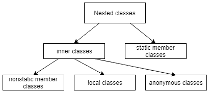

---
tags:
  - Java
  - Classes
  - Inner Classes
---

# 1. Anonymous Classes
**Anonymous classes are inner classes with no name.** Since they have no name, we can’t use them in order to create instances of anonymous classes. As a result, we have to declare and instantiate anonymous classes in a single expression at the point of use.

We may either extend an existing class or implement an interface.

## 1.1. Extend a Class
When we instantiate an anonymous class from an existent one, we use the following syntax:
```
new NameOfTheClassToExtend(...constructor arguemnts){...methods declarations}
```

* **Example:**
```java
new Book("Design Patterns") {
    @Override
    public String description() {
        return "Famous GoF book.";
    }
}
```
Naturally, if the parent class constructor accepts no arguments, we should leave the parentheses empty.

## 1.2. Implement ad Interface
We may instantiate an anonymous class from an interface as well:
```
new NameOfInterfaceToImplement(){...methods implementations}
```
Obviously, Java’s interfaces have no constructors, so the parentheses always remain empty. This is the only way we should do it to implement the interface’s methods:
* **Example:**
```java
new Runnable() {
    @Override
    public void run() {
        ...
    }
}
```
Once we have instantiated an anonymous class, we can assign that instance to a variable in order to be able to reference it somewhere later.

We can do this using the standard syntax for Java expressions:
* **Example:**
```java
Runnable action = new Runnable() {
    @Override
    public void run() {
        ...
    }
};
```
As we already mentioned, an anonymous class declaration is an expression, hence it must be a part of a statement. This explains why we have put a semicolon at the end of the statement.

Obviously, we can avoid assigning the instance to a variable if we create that instance inline:
* **Example:**
```java
List<Runnable> actions = new ArrayList<Runnable>();
actions.add(new Runnable() {
    @Override
    public void run() {
        ...
    }
});
```
We should use this syntax with great care as it might easily suffer the code readability especially when the implementation of the run() method takes a lot of space.

## General picture of anonymous classes
Anonymous classes that we considered above are just a particular case of nested classes. Generally, **a nested class is a class that is declared inside another class or interface**:



Looking at the diagram, we see that _anonymous_ classes along with _local_ and _nonstatic_ member ones form the so-called _inner_ classes. Together with _static member_ classes, they form the _nested_ classes.

# **References:**
1. [Baeldung - Java Anonymous Classes](https://www.baeldung.com/java-anonymous-classes){ target="_blank" rel="noopener noreferrer" }
