---
tags:
  - java
---

# 1. Comparator and Comparable

```mermaid
---
title: Comparator and Comparable in Java
config:
  layout: elk
  elk:
    mergeEdges: true
    nodePlacementStrategy: LINEAR_SEGMENTS
---
graph TB
    A(("Comparator and Comparable in Java")):::main

    A ==> COMPARABLE:::comparableBackground
    subgraph COMPARABLE [COMPARABLE INTERFACE]
        direction LR
        B(("Comparable<br/>Interface")):::comparable
        B --> B1("Defines natural ordering")
        B --> B2("Implemented by the class itself")
        B --> B3("compareTo() method")
        B3 --> B4("Returns -1, 0, or 1")
        B3 --> B5("**Example: Player class implements Comparable**<br/><br/>compareTo(Player otherPlayer) { return Integer.compare(getRanking(), otherPlayer.getRanking()); }")
    end

    A ==> COMPARATOR
    subgraph COMPARATOR [COMPARATOR INTERFACE]
        direction TB
        C(("Comparator<br/>Interface")):::comparator

        C ==> FEATURE:::featureBackground
        subgraph FEATURE
            direction LR
            F1("Defines custom ordering"):::featureHeader
            F2("Implemented by separate class"):::featureHeader
            F3("Advantages: Multiple comparison strategies, No need to modify source code, Avoids adding code to domain classes"):::featureHeader
            F4("**Common Pitfalls:**<br/>Integer overflow with subtraction trick, Use Integer.compare() instead"):::featureHeader
            F5("Handling Null Values: nullsFirst() and nullsLast() methods"):::featureHeader
            F6("compare() method"):::featureHeader
            F6 --> F61("Returns -1, 0, or 1")
            F6 --> F62("**Example:**<br/>PlayerRankingComparator implements Comparator<Player>")
            F6 --> F63("compare(Player firstPlayer, Player secondPlayer) { return Integer.compare(firstPlayer.getRanking(), secondPlayer.getRanking()); }")
        end

        C ==> JAVA8:::java8Background
        subgraph JAVA8 [JAVA 8 Enhancements]
            direction LR
            J("Lambda Expressions & Comparator.comparing()"):::java8Header
            J --> J1("Comparator.comparingInt(), comparingLong(), comparingDouble()")
            J --> J2("**Example:**<br/>Comparator<Player> byRanking = Comparator.comparing(Player::getRanking)")
            J --> J3("**Example:**<br/>Comparator<Player> byAge = Comparator.comparing(Player::getAge)")
            J --> J4("**Example:**<br/>Comparator<Employee> byAge = Comparator.comparingInt(Employee::getAge)")
            J --> J5("**Example:**<br/>Comparator<Employee> bySalary = Comparator.comparingDouble(Employee::getSalary)")
        end

        C ==> ADVANCED:::advancedBackground
        subgraph ADVANCED [ADVANCED SORTING TECHNIQUES]
            direction LR
            AD("Advanced Sorting Techniques"):::advancedHeader

            AD --> AD1("Sorting with Lambdas")
            AD1 --> AD11("**Example:**<br/>humans.sort((h1, h2) -> h1.getName().compareTo(h2.getName()))")
            AD1 --> AD12("**Example:**<br/>humans.sort(Comparator.comparing(Human::getName))")
            
            AD --> AD2("Stream.sorted() API")
            AD2 --> AD21("**Example:**<br/>stream.sorted().collect(Collectors.toList())")
            AD2 --> AD22("**Example:**<br/>stream.sorted(Comparator.comparing(Human::getName)).collect(Collectors.toList())")

            AD --> AD3("Sorting by Multiple Fields")
            AD3 --> AD31("**Example:**<br/>humans.sort(Comparator.comparing(Human::getName).thenComparing(Human::getAge))")

            AD --> AD4("Reverse Sorting")
            AD4 --> AD41("**Example:**<br/>humans.sort(Comparator.comparing(Human::getName).reversed())")
        end
    end

classDef main fill:#008c31,font-size:1.4rem,stroke-width: 0.2rem;
    
classDef comparable fill:#4903a3,stroke-width: 0.2rem;
classDef comparableBackground fill:#4903a3,fill-opacity: 0.2;

classDef comparator fill:#bf9900,stroke-width: 0.2rem;

classDef featureBackground fill:#967800,fill-opacity: 0.2;
classDef featureHeader fill:#967800,stroke-width: 0.2rem;

classDef java8Background fill:#0089a8,fill-opacity: 0.2;
classDef java8Header fill:#0089a8,stroke-width: 0.2rem;

classDef advancedBackground fill:#a81f00,fill-opacity: 0.2;
classDef advancedHeader fill:#a81f00,stroke-width: 0.2rem;
```

# **References:**
1. [Comparator and Comparable in Java - Baeldung](https://www.baeldung.com/java-comparator-comparable){ target="_blank" rel="noopener noreferrer" }
