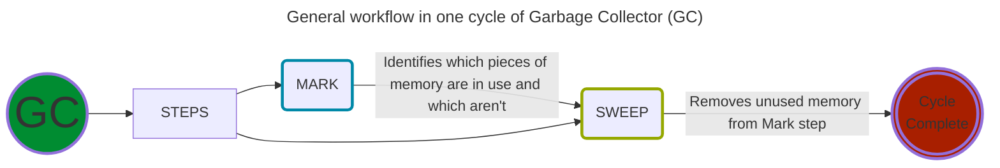
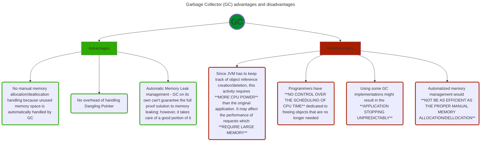
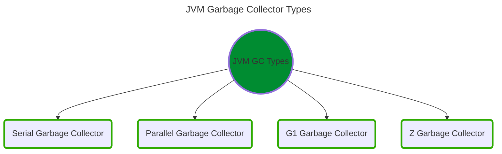
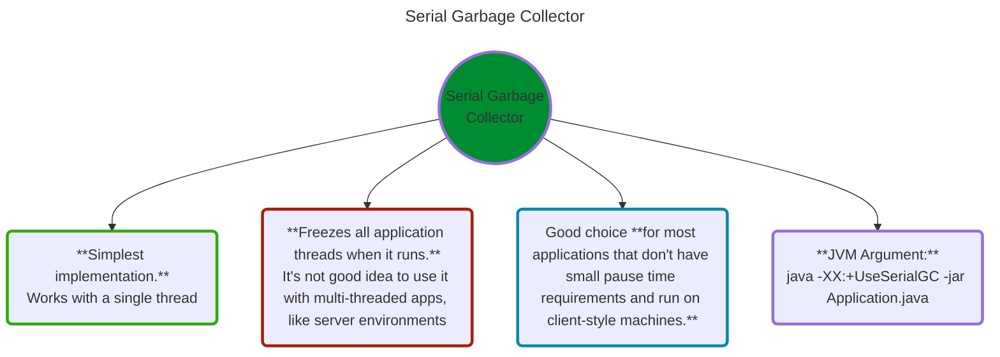
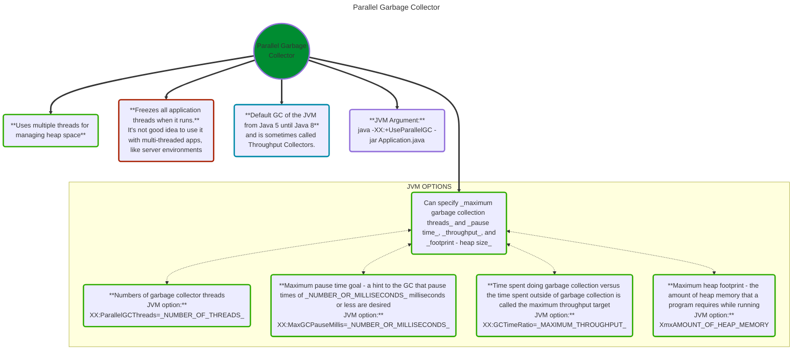
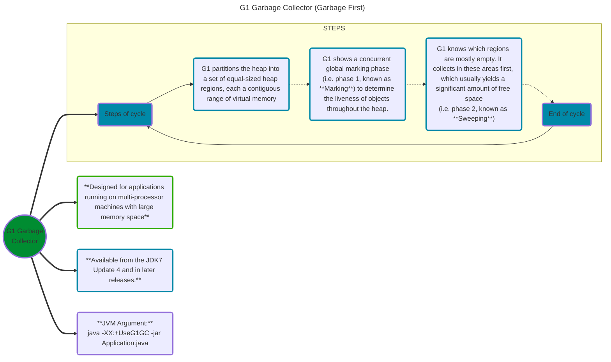
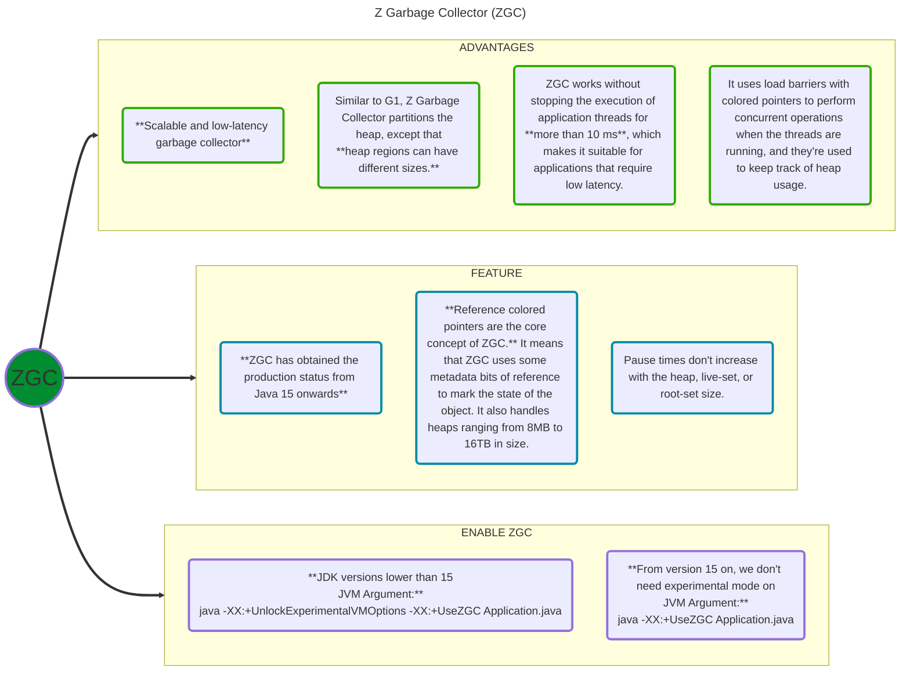

---
tags:
  - java
  - performance
  - platform
  - jvm-languages
  - language-mastery
  - garbage-collector
  - documentation
---
# 1. JVM Garbage Collectors

---

---

---

---

---

---

## Java 8 Changes

_Java 8u20_ has introduced one more _JVM_ parameter for reducing the unnecessary use of memory by creating too many instances of the same _String._ This optimizes the heap memory by removing duplicate _String_ values to a global single _char[]_ array.

We can enable this parameter by adding _**-XX:+UseStringDeduplication**_ as a _JVM_ parameter.

---

# **References:**
1. [JVM Garbage Collectors - Baeldung](https://www.baeldung.com/jvm-garbage-collectors){ target="_blank" rel="noopener noreferrer" }