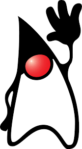

---
tags:
  - jvm-languages
  - java
  - language-mastery
  - java-history
  - documentation
---

# 1. Java mascot

Official Java mascot is:

For over 25 years, Java technology has advanced the world we interact with every day. With Oracle’s stewardship, Java technology continues to offer developers innovative functionality to build out the next generation of applications that bring utility to us, both personally and professionally.

And during the history of Java, it’s been represented by the highly recognized Duke personality. Back in the early days of Java development, Sun Microsystems’ Green Project team created its first working demo, an interactive handheld home entertainment controller called the Star7. At the heart of the animated touch-screen user interface was a cartoon character named Duke.

The jumping, cartwheeling Duke was created by one of the team’s graphic artists, **Joe Palrang.** Joe went on to work on popular animated movies such as Shrek, Over the Hedge, and Flushed Away.

Duke was designed to represent a "software agent" that performed tasks for the user. Duke was the interactive host that enabled a new type of user interface that went beyond the buttons, mice, and pop-up menus of the desktop computing world.

Duke was instantly embraced. In fact, at about the same time Java was first introduced and the first Java cup logo was commissioned, Duke became the official mascot of Java technology. In 2006, Duke was officially "open sourced" under a BSD license.

# **References:**
1. [Wikipedia - Duke Java Mascot](https://en.wikipedia.org/wiki/File:Duke_(Java_mascot)_waving.svg){ target="_blank" rel="noopener noreferrer" }
2. [Dev.java - Duke](https://dev.java/duke/){ target="_blank" rel="noopener noreferrer" }